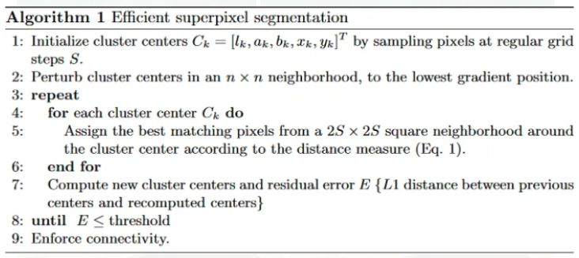

# Superpixels_and_SLIC

## Superpixels
A superpixel can be defined as a group of pixels that share common characteristics. They have a variety of advantages:
- They carry more information than pixels.
- Superpixels have a perceptual meaning since pixels belonging to a given superpixel share similar visual properties.
- They provide a convenient and compact representation of images that can be very useful for computationally demanding problems.

## SLIC (Simple Linear Iterative Clustering) Algorithm for Superpixel generation
The SLIC (Simple Linear Iterative Clustering) algorithm is a method for performing superpixel segmentation on images. It works by clustering pixels in the image space into superpixels based on their color similarity and proximity in the image. SLIC is efficient because it reduces the number of distance calculations needed by limiting the search space to a region around each cluster center. This approach makes it faster and more memory efficient compared to other superpixel algorithms, while still producing high-quality segmentations that adhere closely to image boundaries.
This is done in the five-dimensional [labxy] space, where [lab] is the pixel color vector in CIELAB color space and xy is the pixel position. The SLIC algorithm uses a composite distance measure that combines both color and spatial proximity. This measure ensures that pixels are grouped into superpixels based on their similarity in color and their closeness in the image space. The goal is to create superpixels that are both internally coherent in color and compact in shape, which makes SLIC particularly useful for segmenting images efficiently while preserving important details and boundaries.

### Algorithm

This repository builds a segmentation network, which uses SLIC Superpixels as input. In essense, it will be a classifier for superpixels. The end product is a system which, when given an image, computes superpixels and classifies each superpixel as one of the 9 classes given in the MSRC v1 dataset. 

